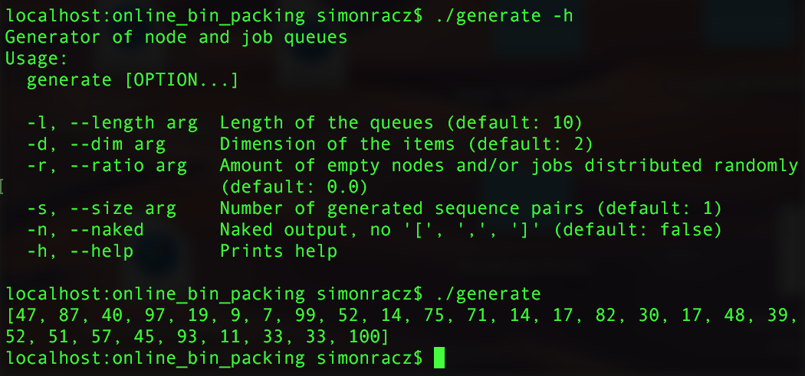
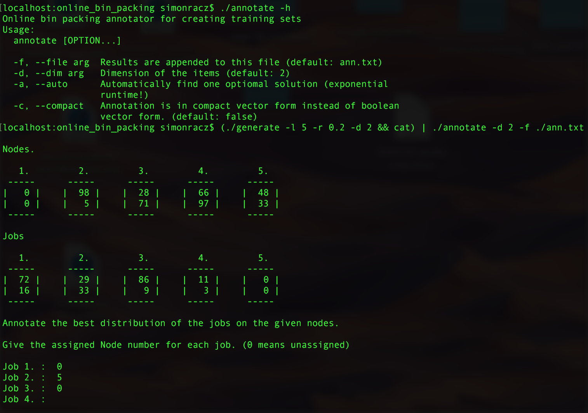
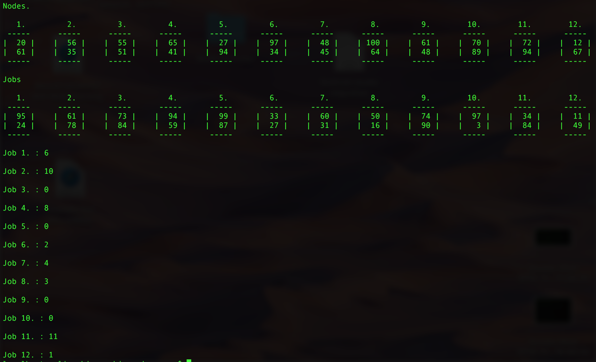
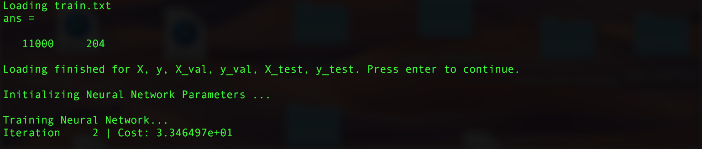
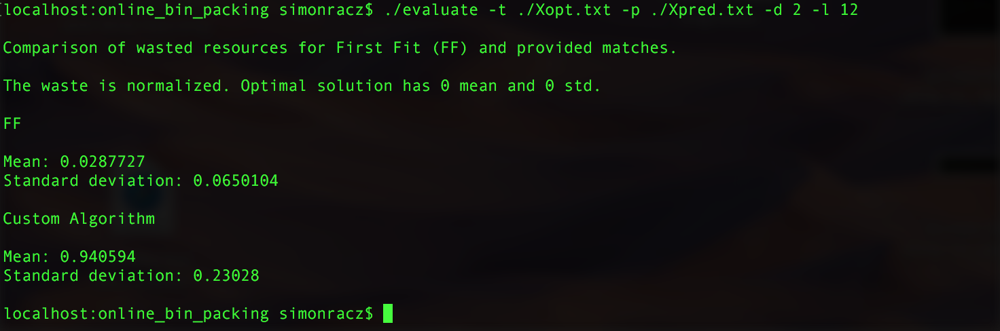

Multi Dimensional Online Bin Packing with Neural Networks
=========================================================

### TLDR

```bash
make
cp ./octave_header.txt ./train.txt
```

```bash
(./generate -l 5 -r 0.2 -d 2 && cat) | ./annotate -d 2 -f ./train.txt
# adjust the header of train.txt
```
For manual annotation.

OR

```bash
./create_training_set.sh ./train.txt
```
For auto annotation. (Grab a coffee for this one. Can last from 5 - 30 min)

```bash
cd octave
cp ../train.txt ./
octave-cli
main
```
Can run for a while. Around 30 min with the default settings.

```bash
cd ..
tail -n +6 ./octave/X_opt.txt > Xopt.txt
tail -n +6 ./octave/X_pred.txt > Xpred.txt
./evaluate -t ./Xopt.txt -p ./Xpred.txt -d 2 -l 12
```

### Description

The goal of this project is to compare a Neural Network algorithm with the First Fit algorithm
on a version of the multi dimensional online bin packing problem.

The end goal is met with a combination of many smaller programs - Unix style.

## generate



## annotate



## create_training_set.sh



## Neural Network calculation with Octave



## evaluate



### Current results

The current implementation uses only one hidden layer. While I expected it to perform worse than First Fit.
It is much worse than that.

### Future plans

Switch to python (theano). Use a deep convolutional neural network. Resources and tasks will naturally fit into this scheme. I expect much better results from it.
